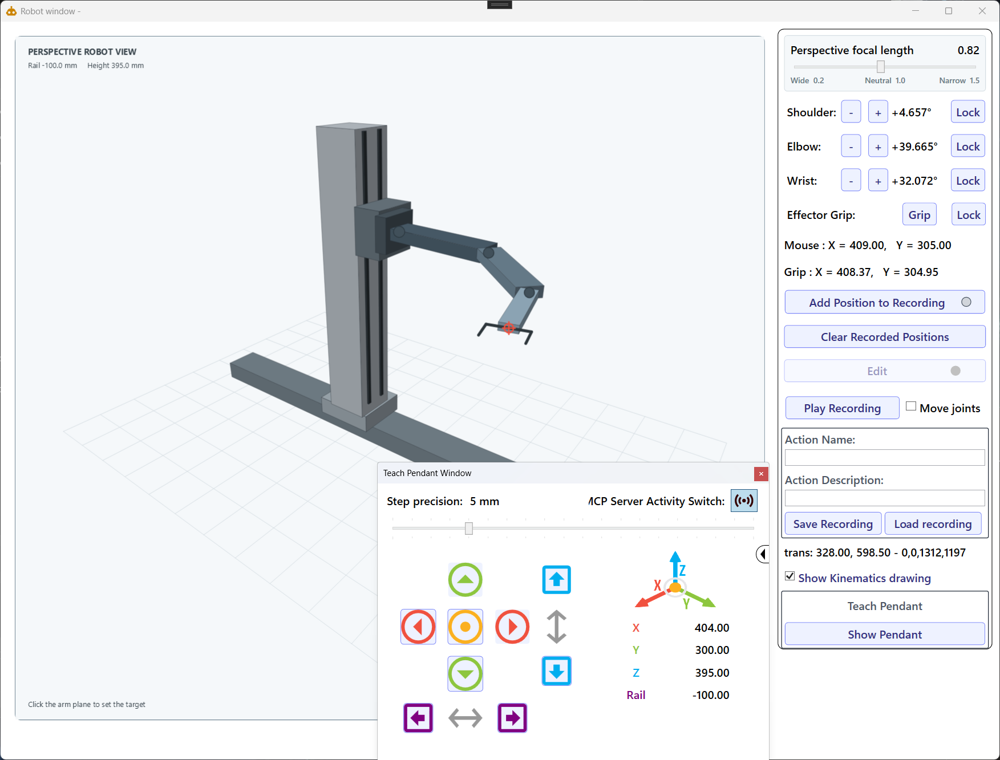
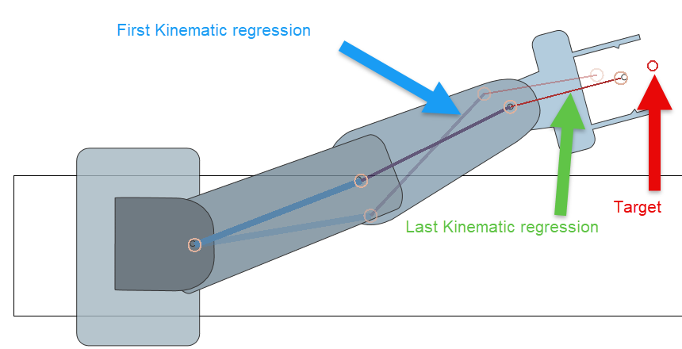
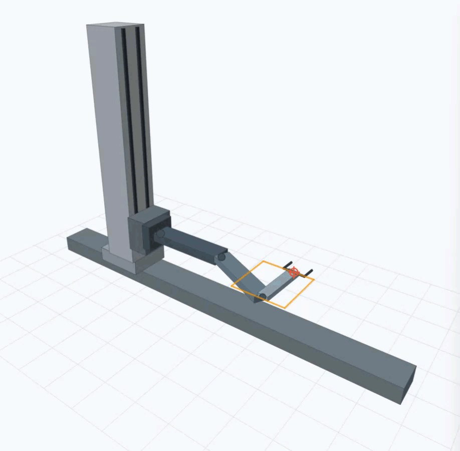

# KinematicsDemo + MCP Server - With MAUI Client
Demo of a **WPF** app showing articulated jointed segments in a kinematic chain.
## The robot we are trying to simulate is a scara robot like the Brooks PF400 (TM) robot
The robot has 3 joints. The first joint is fixed to the origin*, the second joint is fixed to the end of the first segment 
and the third joint is fixed to the second segment. The end effector is the point of grasp
The robot can move on the Z AXis by moving up and down a mast, whilst moving the 2d plan the Arm can operate. (Same with the X or Y axis) if the robot is capable of moving on rails.

## Solution structure
* **WPF** Application for the Robot UI and MCP Server
* **MAUI** Application for the mobile client to connect to the MCP server and control the robot remotely
## Technologies used
* **WPF** for the UI
* SkiaSharp for the overlay kinematic graphics
* The MCP server is started at the begining of the WPF app
* MAUI for the mobile client
* Semantic Kernel  in the MAUI Client to talk to the MCP server using OpenAI GPT LLM to call on the server commands

## Start with simple kinematic chain
in this example we will simulate a scara robot with 3 joints. 
The first joint is fixed to the origin, the second joint is fixed to the first joint and the third joint is fixed to the second joint. The end effector is fixed to the third joint. The joints are drawn
## have the arm follow the mouse pointer (on click) and stretch as close as possible to the target point
The arm will stretch as close as possible to the point where the mouse pointer is. 
**As an overlay on the robot, the first and last step of the kinematic chain is drawn as an example to understand how the inverse kinematics algorithm iterates.** 

## Add independent Joint controllers each joint has a + and - button to increase or decrease the angle of the joint
Simple add a slider to the joints and bind the value to the angle of the joint. The slider is added to the joint and the joint is added to the kinematic chain. The kinematic chain is added to the view model. The view model is added to the view. The view is added to the window. The window is shown.
## Record a series of points the effector will have to follow
The angles of each joint of the robot are recorded as as well as the points and the state of the robot.
( before only the points were recorded in a file. The file is read and the points are plotted.) The points are plotted in a canvas. The canvas is added to the window. The window is shown.
## Play the recorded points and have the arm follow the points while making sure the arm add intermediate points in between based on the distance.

So the arm movement doesn't look jumpy each frame of the arm will be uniform and based on the distance in between the recorded points
The playback is based on Robot joints the angles Delta, (and not anymore the reverse kinematics based on the point to reach)
## The user can lock joints to an angle
each Robot joint can be locked to an angle. The angle is set by the user. The user can lock the joint to an angle by clicking on the button. The joint will be locked to the angle closest to the current angle of the joint. 
The user can unlock the joint by clicking on the button again.
## A teach pendant was added to control the end effector position
The teach pendant is a simple UI that allows the user to control the end effector position. The user can move the end effector on the X and Y axis. The user can also move the end effector on the X,Y,and Z axis
The teach pendant UI also allows the user to record the position. The user can also play the recorded positions, And move the robot on the rail X axis

## The window now contains a small indicator at the bottom to show the position of the robot on the Z axis

# Future work
1. Add the ability to lock the effector endpoint to a point in space
2. Add the ability to lock or move individual joints without affecting the others.
3. fix glitches in the UI related to the Kinematic chain not always reproducing the recorded points correctly
4. Add Robot configurations for different configurations (rail, height, etc..) passed as parameters
5. Add a service to control the robot over a mobile device 
6. Use Microsoft Semantic Kernel to control the robot with LLM mappings form text or voice commands into Service commands

